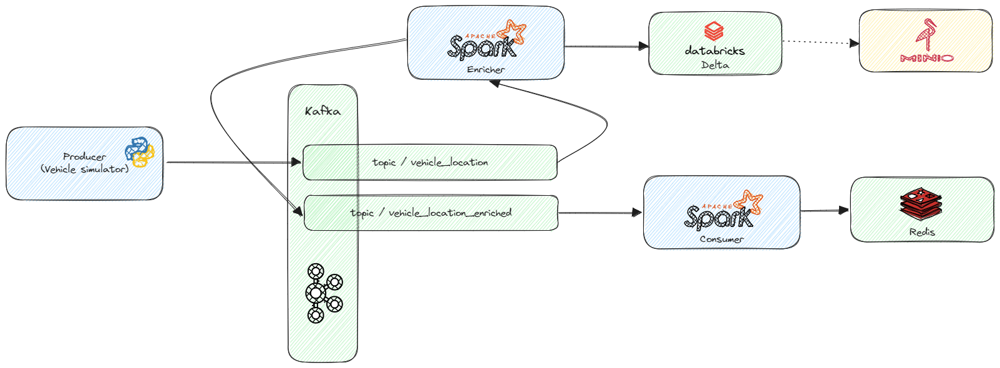

# Data Engineering Challenge
## Init
* Install Poetry (https://python-poetry.org/docs/#installation)
* Create virtual environment & install Python dependencies (`poetry install`)

## Start local services
* docker compose up
  * Zookeeper
  * Kafka
  * Redis
  * MinIO (S3)
    * Console available on http://127.0.0.1:9001 (username: 1234567890 / password: 1234567890)

## Platform / Pipeline diagram

## Start pipelines
* Producer (Raw Kafka producer)
  * `poetry run python3 -m pavol.entrypoint.producer`
  * 1) Simulates movement of vehicles & publishes messages to Kafka
* Enricher (Structured Streaming / Apache Spark)
  * `poetry run python3 -m pavol.entrypoint.enricher`
  * Spark UI available on http://127.0.0.1:4040 (port 4041 if the Consumer is running at the same time)
  * 1) Reads the stream of GPS data.
    2) Adds some new columns to the stream.
    3) Publishes enriched messages to a new Kafka topic for later processing.
    4) Also, stores the enriched data to a Databricks Delta table.
* Consumer (Structured Streaming / Apache Spark)
  * `poetry run python3 -m pavol.entrypoint.consumer`
  * Spark UI available on http://127.0.0.1:4040 (port 4041 if the Enricher is running at the same time)
  * 1) Reads the enriched stream from intermediate Kafka topic.
    2) Then calculates some analytical metrics & stores them into a Redis instance.
